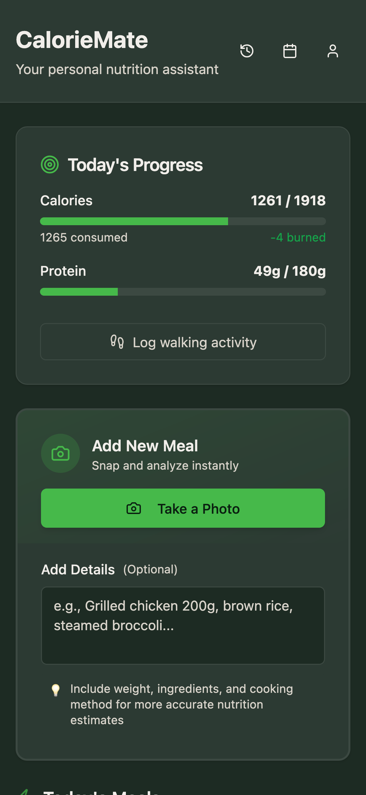
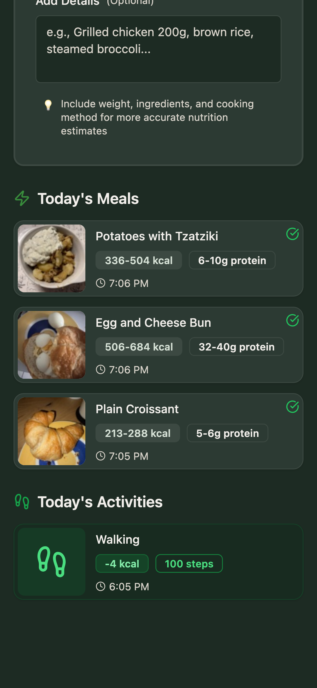

# CalorieMate

<p align="center">
  
  
</p>

A personal project I built to help track what I eat without overthinking it. The idea is simple: snap a photo of your meal, let AI give you a rough estimate of calories and protein, and get back to eating. No fuss, no precise measurements, just enough info to build awareness of what you're consuming.

At the time of writing, I've managed to lose about 7kg using this approach. The goal was never to track everything perfectly, but to get a feel for my eating habits until I can develop that intuition naturally and move on.

I'm making this public in case anyone else finds it useful and wants to self-host their own instance.

## How it works

The core workflow is dead simple:
- Open the app, take a quick picture of your food
- AI analyzes it and gives you rough calorie/protein estimates
- Start eating, no waiting around
- Later, if you want, you can review the meal, add more context (like "this was a large portion" or "180g of oat, 30g of whey protein and 200ml milk", "burata pizza"), and re-analyze for a better estimate

The app focuses on calories and protein since those were my main concerns. The more details you provide, the more accurate the estimates get, but even with minimal info, you get ballpark numbers that are good enough to track trends.

Under the hood, it uses CLIP embeddings to detect similar meals you've logged before, so over time it gets faster at recognizing your regular foods.

## Self-Hosting

The easiest way to run this is with Docker Compose.

### Prerequisites

- Docker and Docker Compose
- OpenRouter API key (recommended) (get one at [openrouter.ai](https://openrouter.ai)), or Ollama for self-hosted AI

### Quick Start

1. Clone the repo:
```bash
git clone https://github.com/yourusername/caloriemate.git
cd caloriemate
```

2. Create a `.env` file:
```bash
cp .env.example .env
```

For best results, use OpenRouter (recommended for quality and speed):
```env
AI_PROVIDER=openrouter
OPENROUTER_API_KEY=your_actual_api_key_here
```

Or use Ollama if you want to keep everything self-hosted:
```env
AI_PROVIDER=ollama
```

Other optional settings:
- `OLLAMA_HOST` - Ollama server address (default: `http://localhost:11434`)
- `OLLAMA_VISION_MODEL` - Ollama vision model (default: `qwen3-vl:8b`)
- `OPENROUTER_VISION_MODEL` - OpenRouter vision model (default: `google/gemini-2.5-flash`)
- `PORT` - Change the exposed port (default: `8080`)

3. Start it up:
```bash
docker compose up -d
```

On first startup, check the logs to grab the admin setup URL with token:
```bash
docker compose logs app | grep "pbinstal"
```

Or view the full logs:
```bash
docker compose logs app
```

Look for a line like:
```
http://0.0.0.0:8080/_/#/pbinstal/eyJhbGciOiJIUzI1NiIsInR5cCI6IkpXVCJ9...
```

Copy that full URL (including the token) and open it in your browser to create your superuser account.

4. Open the app in your browser:
- Main app: `http://localhost:8080`
- Admin dashboard: `http://localhost:8080/_/`

That's it. The app runs two services: the main app (backend + frontend) and a CLIP service for image embeddings. All your data (database, meal photos) is stored in a Docker volume, so it persists between restarts.

### Backing up your data

All data lives in the `pb_data` volume. To back it up:

```bash
docker compose down
docker run --rm -v caloriemate_pb_data:/data -v $(pwd):/backup alpine tar czf /backup/pb_data_backup.tar.gz -C /data .
```

To restore:

```bash
docker run --rm -v caloriemate_pb_data:/data -v $(pwd):/backup alpine tar xzf /backup/pb_data_backup.tar.gz -C /data
```

### Stopping everything

```bash
docker compose down
```

To also wipe the data:

```bash
docker compose down -v
```

## Development Setup

If you want to hack on this locally without Docker:

### Requirements

- Go 1.25+
- Node.js 22+
- Docker (for CLIP service)
- OpenRouter API key (recommended), or Ollama installed locally

### Running locally

1. Install dependencies:
```bash
go mod download
cd frontend && npm install && cd ..
```

2. Create `.env` in the root:
```env
STAGE=dev
CLIP_HOST=http://localhost:8001
AI_PROVIDER=openrouter  # or "ollama" for self-hosted
OPENROUTER_API_KEY=your_api_key_here
```

3. Create `.env` in the frontend folder:
```bash
echo "VITE_POCKETBASE_URL=http://localhost:8080" > frontend/.env
```

4. Start the CLIP service (uses Docker):
```bash
make clip-docker
```

5. In another terminal, start the backend:
```bash
make run
```

6. In another terminal, start the frontend dev server:
```bash
make fe
```

7. Create a test superuser (login: test@test.com / test12345):
```bash
make setup-su
```

Then access:
- Main app: `http://localhost:8080`
- Admin dashboard: `http://localhost:8080/_/`

## Tech Stack

Just some notes on what I used:

- **Backend**: Go with PocketBase (gives you auth, database, file storage out of the box)
- **Frontend**: React, TypeScript, Tailwind CSS, shadcn/ui
- **AI**: OpenRouter (recommended, uses Gemini 2.5 Flash) or Ollama (self-hosted) for meal analysis, OpenAI CLIP for image embeddings
- **Database**: SQLite with sqlite-vec extension for vector similarity search

## A note on accuracy

This is not a medical device or a precision nutrition tracker. The calorie and protein estimates are rough approximations based on what an AI vision model thinks it sees in your photo. They're meant to give you a general sense of what you're eating, not exact numbers.

If you need precise tracking for medical reasons, use a proper nutrition app with a food database and weigh your portions.

## License

MIT - do whatever you want with it.
